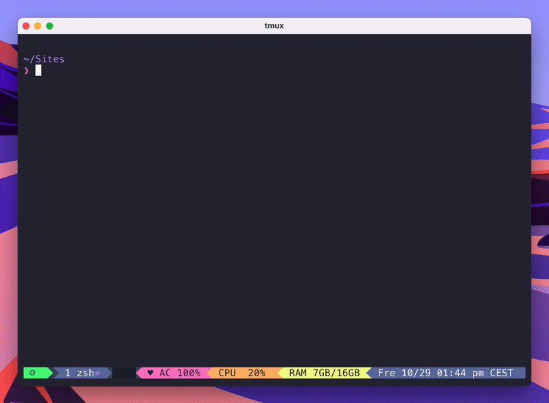

# lisa-cli ⚡️


💁‍♀️ Lisa CLI is a commanded line tool that will help you to automate the process of creating a new site based on the [lisa-app](https://github.com/triggerfishab/lisa-app) and the [lisa-api](https://github.com/triggerfishab/lisa-api)

The features that is included now is the following:
* Setup repos on GitHub based on the [lisa-app](https://github.com/triggerfishab/lisa-app) and the [lisa-api](https://github.com/triggerfishab/lisa-api) repos.
* Setup site with Valet, including dependencies installation and local database creation.
* Reencrypt all vault files with a new password
* Create a development database
* Add all the config needed to be able to deploy the site to Kinsta with Trellis

## 🔧 Prerequisites
You will need to install the following stuff to use lisa-cli:
* [Node](https://nodejs.org/en/) version >= 12
* [GitHub CLI](https://github.com/cli/cli) ([setup instructions](https://cli.github.com/manual/))
* [ansible-vault](https://docs.ansible.com/ansible/2.9/user_guide/vault.html) (comes from Ansible)
* [WP-CLI](https://wp-cli.org/)
* [Trellis CLI](https://github.com/roots/trellis-cli)
* [Valet](https://laravel.com/docs/8.x/valet)
## 🪚 Installation
```npm i -g lisa-cli```

## 🏃‍♂️ Usage
From your generic sites folder (i.e. `~/Sites`) run the following command:

```lisa init```

You will also need to create a YAML file with all the config from Kinsta, run the following command to get a file template:

```lisa kinsta --help```

## 🔨 TODO
- Local Trellis development
	- S3 bucket
	- Stackpath domain
	- Sendgrid
- Stackpath
- Sendgrid
- S3
- GoDaddy
